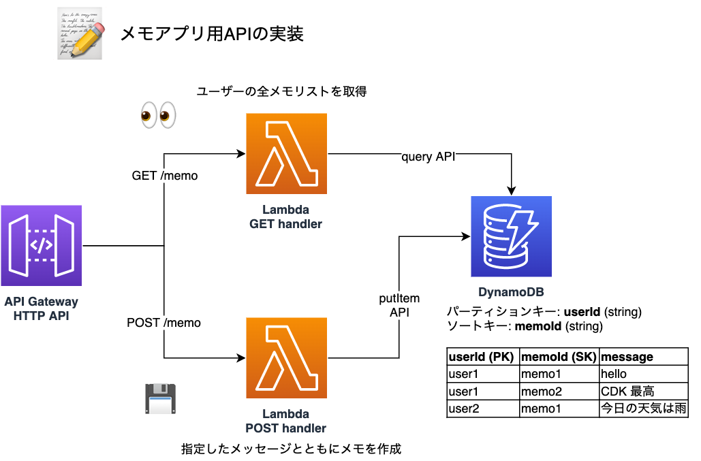

# DevAx::connect CDK実践勉強会
DevAx::connect CDK実践勉強会のライブコーディングでお見せしたコードです。

テストのパートでご紹介したテストコードも含まれます。開催後の[ブログ記事はこちら](https://aws.amazon.com/jp/blogs/news/devaxconnect-cdk-study/)。



## 使い方
前提として、下記のソフトウェアをインストールしてください:

* [AWS CLI](https://docs.aws.amazon.com/cli/latest/userguide/getting-started-install.html)
* [Node.js (LTS版)](https://nodejs.dev/learn/how-to-install-nodejs)
* [Docker](https://docs.docker.com/get-docker/)

### Stackのデプロイ
```sh
npm ci
npx cdk bootstrap
npx cdk deploy
```

### 単体テストの実行
```sh
npm run test
npm run test -- -u # snapshotを更新する場合
```

## 参考情報
CDKに興味をお持ちの方、始めてみたい方は、こちらの情報もご参照ください:
* [CDK Workshop](https://cdkworkshop.com/)
    * ゼロからCDKでアプリケーションを構築するワークショップです
* [AWS CDK Examples](https://github.com/aws-samples/aws-cdk-examples)
    * CDKのサンプルコード集です　多様なシステムのコード例が言語別に掲載されています
* [Construct Hub](https://constructs.dev/)
    * CDKのConstruct一覧です　日々様々なConstructが開発･公開されています

## Security
See [CONTRIBUTING](CONTRIBUTING.md#security-issue-notifications) for more information.

## License
This library is licensed under the MIT-0 License. See the LICENSE file.
